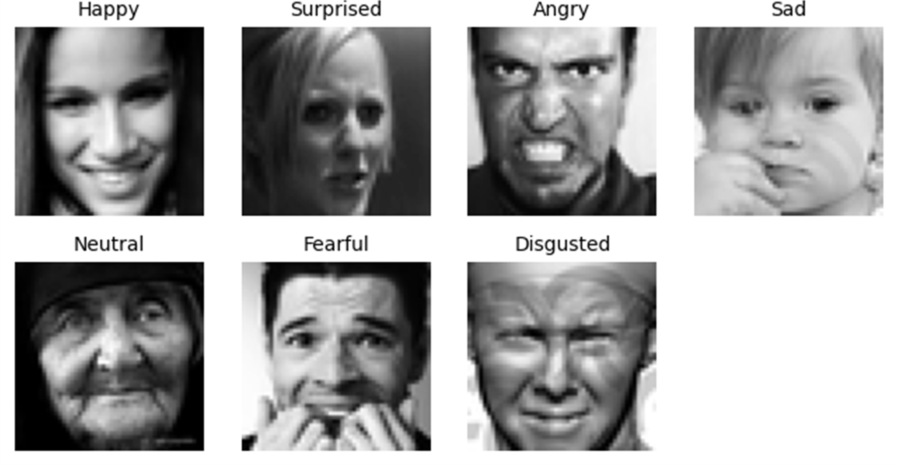

# 📁 Dataset – FER2013 (Facial Emotion Recognition)

The image data used in this project comes from the publicly available FER2013 dataset on Kaggle. It contains **35,685 grayscale images** (48x48 pixels) of facial expressions, each labeled with one of **7 emotions**:

- 😠 angry  
- 🤢 disgusted  
- 😨 fearful  
- 😀 happy  
- 😐 neutral  
- 😢 sad  
- 😲 surprised  

## 🖼️ Sample Images

Below is a sample image for each emotion category (taken directly from the training set):

## ⚖️ Data Imbalance

The *disgusted* class was underrepresented and required augmentation. This was addressed in the notebook [`BilderDigustVermehrfachungundPlot.ipynb`](../notebook/BilderDigustVermehrfachungundPlot.ipynb) by applying targeted data augmentation:

- Rotation  
- Horizontal Flips  

## 🔗 Dataset Source

You can view and download the original data here:  
➡️ [Kaggle – Facial Emotion Recognition (FER2013)](https://www.kaggle.com/datasets/ananthu017/emotion-detection-fer/data)

⚠️ **Note:**  
Due to licensing, the original image files are not included in this repository.